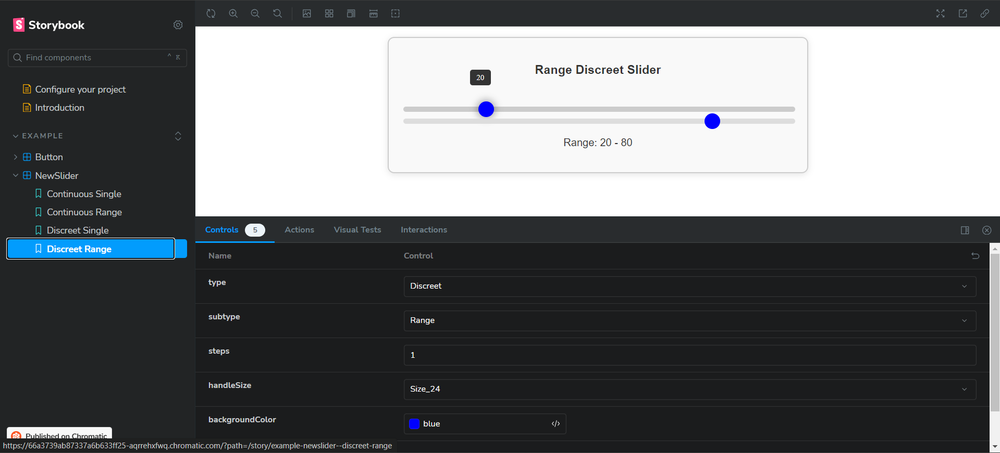

# QuickReply.ai-Assesment

## Overview

This project involves the creation of a `Slider` component, which has been integrated into Storybook for comprehensive testing and demonstration And published on chromatic. The component features customizable properties and interactive states, and it is designed to be fully functional and ready for use in any project. 

## Features

- **Type**: Can be set to either `Continuous` or `Discreet`.
- **Subtype**: Options include `Single` or `Range`.
- **Number of Steps**: Applicable for the `Discreet` type, with a maximum of 10 steps.
- **Handle Size**: Options include `Size_24` or `Size_32`.
- **Interactive States**:
  - **Hover State**: Handle displays a distinct style when hovered.
  - **Active State**: Handle displays a distinct style when dragged.
 
    
## Tech Stack

- **React**: JavaScript library for building user interfaces.
- **Storybook**: Tool for developing and showcasing UI components in isolation.
- **CSS**: For styling the component.
- **chromatic**: For publishing the component

## Storybook Integration

### Properties

In Storybook, the Slider component can be configured using the following controls:

- **Type**: Select between `Continuous` and `Discreet`.
- **Subtype**: Choose `Single` or `Range`.
- **Number of Steps**: Set the number of steps (up to 10) for the `Discreet` type.
- **Handle Size**: Choose between `Size_24` and `Size_32`.

### Actions

- **Slider Position Change**: An event is triggered and displayed in the Actions tab when the slider's position is changed. The event will show the value or range selected by the slider.

## Deployed Links

- **Github**: [https://github.com/Jainprashuk/QuickReply.ai-Assesment](https://github.com/Jainprashuk/QuickReply.ai-Assesment)
- **Storybook chromatic**: [https://66a3739ab87337a6b633ff25-aqrrehxfwq.chromatic.com/?path=/story/example-newslider--continuous-single](https://66a3739ab87337a6b633ff25-aqrrehxfwq.chromatic.com/?path=/story/example-newslider--continuous-single)

## ScreenShots Of Projects

*Continious Single*

*Continious range*

*discreet Single*

*discreet range*

